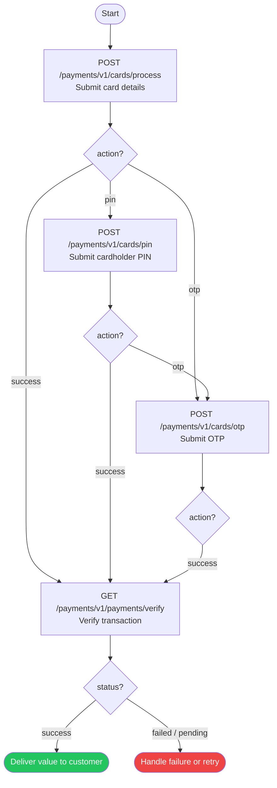

Direct Card (Host-to-Host) lets your backend collect and process card payments entirely server-to-server. There is no redirect to a hosted checkout page — your UI captures the card details and your server drives every authentication step.

<Warning>
  This integration handles raw card data (PAN, CVV, PIN). You must be PCI DSS compliant or operate within a compliant environment. Card data must never be logged or stored beyond strict necessity.
</Warning>

## When To Use Direct Card

<CardGroup cols={3}>
  <Card title="Custom Card UI" icon="pen-to-square">
    You own the card entry form and want full control over the user experience.
  </Card>
  <Card title="No Redirects" icon="ban">
    Your flow cannot accommodate a redirect to an external payment page.
  </Card>
  <Card title="Server-to-Server" icon="server">
    Payment initiation and authentication happen entirely from your backend.
  </Card>
</CardGroup>

## Endpoints

| Method | Endpoint | Purpose |
| --- | --- | --- |
| `POST` | `/payments/v1/cards/process` | Submit card details and initiate the charge |
| `POST` | `/payments/v1/cards/pin` | Submit cardholder PIN (if required) |
| `POST` | `/payments/v1/cards/otp` | Submit one-time password (if required) |
| `GET` | `/payments/v1/payments/verify/{reference}` | Verify final transaction status before delivering value |

## Authentication Flow

The integration uses a **challenge-response** pattern. Each request returns an `action` that tells you what the next step is.



## Required Headers

All requests must include:

| Header | Value |
| --- | --- |
| `client-id` | `your client-id from the dashboard` |
| `client-secret` | `your client-secret from the dashboard` |

---

## Integration Steps

<Steps>
  <Step title="Submit card details">
    Send card credentials and checkout context to `/payments/v1/cards/process`. You will receive a `reference` and the first `action`.
  </Step>
  <Step title="Handle PIN challenge (if required)">
    If `action` is `pin`, prompt the cardholder for their PIN and submit it to `/payments/v1/cards/pin`.
  </Step>
  <Step title="Handle OTP challenge (if required)">
    If `action` is `otp`, display the OTP prompt message to the cardholder and submit their input to `/payments/v1/cards/otp`.
  </Step>
  <Step title="Verify before delivering value">
    Once `action` is `success`, call `GET /payments/v1/payments/verify/{reference}` to confirm the final status on your server. Only deliver value to the customer after receiving `status: "success"` from this endpoint.
  </Step>
</Steps>

---

## Step 1 — Submit Card Details

Initiate the charge with the card credentials and checkout context.

```bash
curl --location 'https://sandbox-api.payfonte.com/payments/v1/cards/process' \
  --header 'client-id: {{clientId}}' \
  --header 'client-secret: {{clientSedret}}' \
  --header 'Content-Type: application/json' \
  --data '{
    "checkoutId": "<checkout_id>",
    "provider": "card-nigeria",
    "card": {
      "pan": "5061460410121111105",
      "expiry": {
        "month": "12",
        "year": "50"
      },
      "cvv": "561",
      "cardHolderName": "John Doe"
    }
  }'
```

### Request Fields

| Field | Type | Required | Description |
| --- | --- | --- | --- |
| `clientId` | string | Yes | Your 6thBridge client identifier |
| `checkoutId` | string | Yes | Checkout session ID from your checkout initiation |
| `provider` | string | Yes | Payment provider slug. Use `card-nigeria` for Nigerian cards |
| `card.pan` | string | Yes | Card Primary Account Number |
| `card.expiry.month` | string | Yes | Expiry month (`MM` format) |
| `card.expiry.year` | string | Yes | Expiry year (`YY` format) |
| `card.cvv` | string | Yes | Card Verification Value |
| `card.cardHolderName` | string | Yes | Full name of the cardholder |

### Response

```json
{
  "statusCode": 200,
  "data": {
    "reference": "D20240224072152MUWZF",
    "action": "pin"
  }
}
```

<Note>
  Save the `reference` from this response. It is your canonical transaction identifier and is required in all subsequent steps.
</Note>

### `action` Values

| Value | Meaning | Next Step |
| --- | --- | --- |
| `pin` | Card requires PIN authentication | Proceed to Step 2 |
| `otp` | Card requires OTP authentication | Proceed to Step 3 |
| `redirect` | Card requires 3DS redirect | Handle redirect flow |
| `success` | No further challenge — proceed to verify | Proceed to Step 4 |

---

## Step 2 — Submit PIN

Only required if `action` from Step 1 is `pin`.

```bash
curl --location 'https://sandbox-api.payfonte.com/payments/v1/cards/pin' \
  --header 'request-client-id: payfusion' \
  --header 'Content-Type: application/json' \
  --data '{
    "clientId": "6thbridge",
    "reference": "<reference_from_step_1>",
    "checkoutId": "<checkout_id>",
    "provider": "card-nigeria",
    "card": {
      "pan": "5061460410121111106",
      "expiry": {
        "month": "12",
        "year": "50"
      },
      "cvv": "562",
      "pin": "1105",
      "cardHolderName": "John Doe"
    }
  }'
```

### Request Fields

| Field | Type | Required | Description |
| --- | --- | --- | --- |
| `clientId` | string | Yes | Your 6thBridge client identifier |
| `reference` | string | Yes | Reference received from Step 1 |
| `checkoutId` | string | Yes | Same checkout session ID used in Step 1 |
| `provider` | string | Yes | Same provider used in Step 1 |
| `card.pan` | string | Yes | Card PAN |
| `card.expiry.month` | string | Yes | Card expiry month |
| `card.expiry.year` | string | Yes | Card expiry year |
| `card.cvv` | string | Yes | Card CVV |
| `card.pin` | string | Yes | Cardholder PIN |
| `card.cardHolderName` | string | Yes | Full name of the cardholder |

### Response

```json
{
  "statusCode": 200,
  "data": {
    "statusDescription": "Awaiting OTP input",
    "action": "otp",
    "providersReference": "FLW-MOCK-6beba71b02c38ce13aaf05dc996a09fa",
    "reference": "D20240224072152MUWZF",
    "data": {
      "message": "Please enter the OTP sent to your mobile number 080****** and email te**@rave**.com"
    }
  }
}
```

---

## Step 3 — Submit OTP

Only required if `action` is `otp`. Display the `data.data.message` from the previous response to the cardholder, then submit their input.

```bash
curl --location 'https://sandbox-api.payfonte.com/payments/v1/cards/otp' \
  --header 'request-client-id: payfusion' \
  --header 'Content-Type: application/json' \
  --data '{
    "clientId": "6thbridge",
    "reference": "<reference_from_previous_step>",
    "otp": "543210"
  }'
```

### Request Fields

| Field | Type | Required | Description |
| --- | --- | --- | --- |
| `clientId` | string | Yes | Your 6thBridge client identifier |
| `reference` | string | Yes | Transaction reference from Step 1 or Step 2 |
| `otp` | string | Yes | One-time password entered by the cardholder |

### Response

```json
{
  "statusCode": 200,
  "data": {
    "statusDescription": "Successful",
    "action": "success",
    "reference": "D20240224072152MUWZF",
    "providersReference": "FLW-MOCK-6beba71b02c38ce13aaf05dc996a09fa"
  }
}
```

---

## Step 4 — Verify Before Delivering Value

<Warning>
  **Do not deliver value based solely on a `success` action from the card endpoints.** Always call the verify endpoint from your server to confirm the final transaction status before fulfilling an order, crediting an account, or granting access.
</Warning>

After receiving `action: "success"`, make a server-side call to the verify endpoint using the transaction `reference`:

```bash
curl --location 'https://sandbox-api.payfonte.com/payments/v1/payments/verify/<reference>' \
  --header 'client-id: <client-id>' \
  --header 'client-secret: <client-secret>'
```

### Response

```json
{
  "data": {
    "clientId": "6thbridge",
    "status": "success",
    "statusDescription": "SUCCESSFUL",
    "reference": "D20240224072152MUWZF",
    "externalReference": "ORDER-1001",
    "providersReference": "FLW-MOCK-6beba71b02c38ce13aaf05dc996a09fa",
    "currency": "NGN",
    "charge": 5,
    "totalAmount": 1005,
    "amount": 1000,
    "channel": "card",
    "provider": "card-nigeria",
    "checkoutId": "69651ca8bf1ff6b132d93a47",
    "paidAt": 1768234193
  }
}
```

### Response Fields

| Field | Type | Description |
| --- | --- | --- |
| `status` | string | Final transaction status: `success`, `failed`, or `pending` |
| `statusDescription` | string | Human-readable status message |
| `reference` | string | 6thBridge transaction reference |
| `externalReference` | string | Your original merchant reference |
| `providersReference` | string | Upstream provider's transaction ID |
| `amount` | integer | Transaction amount in minor units |
| `totalAmount` | integer | Amount including charges |
| `charge` | integer | Processing fee |
| `currency` | string | Transaction currency (for example `NGN`) |
| `channel` | string | Payment channel (`card`) |
| `paidAt` | integer | Unix timestamp of payment confirmation |

### Status Handling

| Status | Action |
| --- | --- |
| `success` | Deliver value to the customer |
| `failed` | Inform the customer and do not fulfil the order |
| `pending` | Wait — poll again or rely on the webhook for final status |

---

## Error Handling

All endpoints return a consistent error shape:

```json
{
  "statusCode": 400,
  "message": "Invalid card details",
  "error": "Bad Request"
}
```

| Status Code | Meaning |
| --- | --- |
| `200` | Request processed successfully |
| `400` | Bad request — invalid or missing fields |
| `401` | Unauthorized — invalid `clientId` or missing header |
| `404` | Reference or checkout session not found |
| `422` | Unprocessable — card declined or validation failed |
| `500` | Internal server error |

---

## Important Notes

<AccordionGroup>
  <Accordion title="PCI Compliance" icon="shield-halved" defaultOpen>
    Card data (`pan`, `cvv`, `pin`) must be collected over HTTPS. Never log or store this data beyond what is strictly necessary for the transaction. Ensure your environment meets PCI DSS requirements before using this integration.
  </Accordion>
  <Accordion title="Reference Persistence" icon="bookmark">
    The `reference` returned in Step 1 is the canonical transaction identifier. Persist it on your side **before** proceeding to subsequent steps. All follow-up calls and verifications use this reference.
  </Accordion>
  <Accordion title="OTP Expiry" icon="clock">
    OTPs are time-limited. Display the OTP prompt to the cardholder immediately after PIN submission and submit their input without delay.
  </Accordion>
  <Accordion title="Idempotency" icon="rotate">
    Do not resubmit the same `reference` with different card data. Each reference is bound to a specific card transaction. To retry with different details, start a new checkout session.
  </Accordion>
</AccordionGroup>

## Related Docs

<CardGroup cols={3}>
  <Card title="Direct Charge API" icon="bolt" href="/en/guides/collections/direct-charge-api">
    Initiate direct charges for mobile money and other providers.
  </Card>
  <Card title="Webhooks" icon="webhook" href="/en/guides/collections/webhook">
    Receive async payment status updates on your server.
  </Card>
  <Card title="Supported Providers" icon="globe-africa" href="/en/guides/introductions/supported-providers">
    Provider slugs, limits, and country coverage.
  </Card>
</CardGroup>
