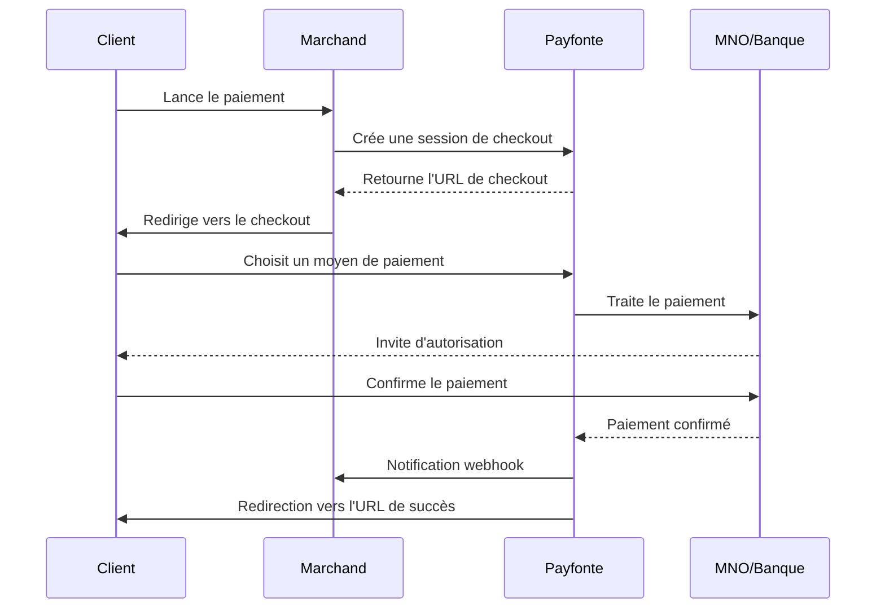

Payfonte propose plusieurs méthodes pour collecter les paiements de vos clients à travers l'Afrique via notre **API d'orchestration de paiement**. Acceptez les principaux **moyens de paiement alternatifs (APM)** et **moyens de paiement locaux en Afrique** via une seule intégration.

---

## Méthodes d'intégration

<CardGroup cols={2}>
  <Card title="Checkout inline" icon="window-maximize" href="/fr/guides/collections/inline">
    **Intégré à votre page**

    Affichez un formulaire de paiement directement sur votre site sans rediriger le client. Idéal pour une expérience fluide.
  </Card>

  <Card title="Checkout standard" icon="arrow-up-right-from-square" href="/fr/guides/collections/standard">
    **Redirection vers Payfonte**

    Redirigez le client vers une page de paiement hébergée par Payfonte. C'est l'intégration la plus simple avec une prise en charge complète des moyens de paiement.
  </Card>

  <Card title="Direct Charge" icon="bolt" href="/fr/guides/collections/direct-charge-api">
    **Serveur à serveur**

    Initiez les débits directement via l'API pour les paiements récurrents ou lorsque vous avez déjà collecté les informations de paiement.
  </Card>

  <Card title="Liens de paiement" icon="link">
    **Option sans code**

    Générez des URL de paiement partageables depuis le dashboard. Pratique pour les factures, les réseaux sociaux et les campagnes e-mail.
  </Card>
</CardGroup>

---

## Comparaison rapide

| Méthode | Effort d'intégration | Expérience client | Cas d'usage |
|--------|----------------------|-------------------|-------------|
| **Standard** | Faible | Redirection vers une page hébergée | La plupart des marchands |
| **Inline** | Moyen | Intégré à votre site | UX fluide |
| **Direct Charge** | Élevé | Pas d'interface, côté serveur | Récurrent, cartes enregistrées |
| **Liens de paiement** | Aucun | Paiement via lien | Factures, paiements ponctuels |

---

## Vue d'ensemble du flux de paiement



---

## Moyens de paiement alternatifs pris en charge

| Région | Mobile Money API | Virement bancaire | Cartes |
|--------|------------------|-------------------|--------|
| **Nigeria** | **MTN MoMo API**, Airtel, Opay, PalmPay | ✅ Oui | Via partenaire |
| **Ghana** | **MTN MoMo API**, AirtelTigo, Telecel | Bientôt disponible | Via partenaire |
| **Kenya** | **M-Pesa API** | ✅ Oui | Via partenaire |
| **Tanzanie** | **M-Pesa API**, **Airtel Money API**, Halopesa, Tigo | Bientôt disponible | - |
| **Afrique de l'Ouest (CFA)** | Orange Money, MTN, **intégration Wave**, Moov | - | - |

Voir [Providers pris en charge](/fr/guides/introductions/supported-providers) pour la liste complète des **moyens de paiement locaux en Afrique**.

---

## Requête de collecte minimale

Voici un exemple minimal pour créer une session de checkout :

```bash
curl --location 'https://sandbox-api.payfonte.com/payments/v1/checkouts' \
  --header 'client-id: YOUR_CLIENT_ID' \
  --header 'client-secret: YOUR_CLIENT_SECRET' \
  --header 'Content-Type: application/json' \
  --data '{
    "reference": "ORDER-001",
    "amount": 5000,
    "currency": "NGN",
    "country": "NG",
    "redirectURL": "https://yoursite.com/payment/complete",
    "webhook": "https://yoursite.com/webhooks/payfonte",
    "user": {
      "email": "customer@example.com",
      "phoneNumber": "08012345678"
    }
  }'
```

### Paramètres requis

| Paramètre | Type | Description |
|-----------|------|-------------|
| `reference` | string | Votre identifiant de commande ou de transaction unique |
| `amount` | integer | Montant en sous-unités, voir [Spécification des montants](/fr/guides/introductions/amount-specification) |
| `currency` | string | Code devise ISO, par exemple NGN, KES, GHS, XOF |
| `country` | string | Code pays ISO, par exemple NG, KE, GH |
| `redirectURL` | string | URL vers laquelle rediriger le client après paiement |

### Paramètres optionnels

| Paramètre | Type | Description |
|-----------|------|-------------|
| `webhook` | string | URL pour les notifications de paiement |
| `user.email` | string | Adresse e-mail du client |
| `user.phoneNumber` | string | Numéro de téléphone du client |
| `metadata` | object | Données personnalisées à attacher à la transaction |

---

## Valeurs de statut

Les statuts de collecte renvoyés par l'API sont :

- `pending`
- `failed` - final
- `success` - final

## Traitement des webhooks

Nous envoyons des notifications webhook lors des changements de statut de paiement. En production, implémentez toujours leur traitement :

```javascript
app.post('/webhooks/payfonte', (req, res) => {
  const event = req.body;

  switch (event.event) {
    case 'payment.completed':
      // Paiement réussi : exécuter la commande
      fulfillOrder(event.data.reference);
      break;
    case 'payment.failed':
      // Paiement échoué : informer le client
      notifyCustomer(event.data.reference);
      break;
  }

  res.status(200).send('OK');
});
```

Voir [Webhooks](/fr/guides/collections/webhook) pour la documentation complète.

---

## Bonnes pratiques

<AccordionGroup>
  <Accordion title="Toujours utiliser des références uniques" icon="fingerprint">
    Générez une valeur `reference` unique pour chaque transaction. Cela évite les doubles débits et simplifie le rapprochement.
  </Accordion>

  <Accordion title="Implémenter l'idempotence" icon="repeat">
    Votre système doit gérer les retries de webhook sans effet de bord. Vérifiez si une commande est déjà traitée avant de la rejouer.
  </Accordion>

  <Accordion title="Vérifier le statut de transaction" icon="check-double">
    Après réception d'un webhook, vérifiez le statut de la transaction via l'API avant d'exécuter la commande.
  </Accordion>

  <Accordion title="Gérer les délais d'attente correctement" icon="clock">
    Certains moyens de paiement, comme l'USSD, prennent du temps. Affichez au client un état d'attente adapté.
  </Accordion>
</AccordionGroup>

---

## Étapes suivantes

<CardGroup cols={2}>
  <Card title="Checkout inline" icon="window-maximize" href="/fr/guides/collections/inline">
    Intégrer les paiements à votre site
  </Card>
  <Card title="Checkout standard" icon="arrow-up-right-from-square" href="/fr/guides/collections/standard">
    Intégration par redirection
  </Card>
  <Card title="Configuration webhook" icon="bell" href="/fr/guides/collections/webhook">
    Traiter les notifications de paiement
  </Card>
  <Card title="Référence API" icon="code" href="/fr/api-reference/introduction">
    Documentation API complète
  </Card>
</CardGroup>
