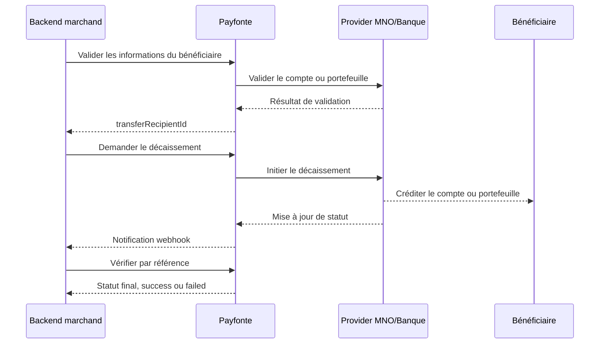

Utilisez les décaissements Payfonte pour envoyer des fonds à des bénéficiaires validés via les providers et marchés pris en charge.

## Résumé du flux

<CardGroup cols={3}>
  <Card title="1. Valider le bénéficiaire" icon="user">
    Confirmez les informations du compte bénéficiaire avant le décaissement.
  </Card>
  <Card title="2. Demander le décaissement" icon="money-bill-transfer">
    Initiez le décaissement avec le montant, l'identifiant du bénéficiaire et le mode d'autorisation.
  </Card>
  <Card title="3. Vérifier le statut final" icon="check-double">
    Confirmez le résultat via l'endpoint de vérification et/ou le webhook.
  </Card>
</CardGroup>

## Vue d'ensemble du flux de décaissement



## Endpoints

| Méthode | Endpoint | Objet |
| --- | --- | --- |
| `GET` | `/billing/v1/transfer-recipients/{provider}/properties` | Récupérer les propriétés spécifiques au provider, optionnel |
| `POST` | `/billing/v1/transfer-recipients/validate` | Valider les informations du bénéficiaire |
| `POST` | `/billing/v1/disbursements` | Demander un décaissement |
| `GET` | `/billing/v1/disbursements/verify/{reference}` | Vérifier le statut du décaissement |

## Prérequis

- Un `client-id` et un `client-secret` valides
- Un solde suffisant dans le portefeuille de décaissement
- Une configuration d'autorisation du décaissement, `pin` ou URL d'autorisation
- Un slug provider valide depuis [Providers pris en charge](/fr/guides/introductions/supported-providers)

## Étape 1 : valider le bénéficiaire

### 1.1 Récupérer les propriétés du provider, optionnel

Certains providers requièrent des détails supplémentaires, par exemple une liste de banques ou des options de réseau, avant la validation.

```bash
curl --location 'https://sandbox-api.payfonte.com/billing/v1/transfer-recipients/{provider}/properties' \
  --header 'client-id: <client-id>' \
  --header 'client-secret: <client-secret>'
```

### 1.2 Valider le bénéficiaire

Exemple pour un virement bancaire :

```json
{
  "currency": "NGN",
  "country": "NG",
  "provider": "bank-transfer-nigeria",
  "account": {
    "accountNumber": "0123456789",
    "bankCode": "044"
  }
}
```

Exemple pour le mobile money :

```json
{
  "currency": "XOF",
  "country": "CI",
  "provider": "wave-ivory-coast",
  "account": {
    "phoneNumber": "2250538102474"
  }
}
```

Exemple de réponse :

```json
{
  "data": {
    "id": "recipient-id",
    "currency": "NGN",
    "country": "NG",
    "provider": "bank-transfer-nigeria",
    "accountLabel": "Bank Transfer | Zenith Bank | Dummy User | 0123456789",
    "account": {
      "accountNumber": "0123456789",
      "bankCode": "044"
    }
  }
}
```

Enregistrez `data.id` comme `transferRecipientId`.

## Étape 2 : demander le décaissement

```bash
curl --location 'https://sandbox-api.payfonte.com/billing/v1/disbursements' \
  --header 'client-id: <client-id>' \
  --header 'client-secret: <client-secret>' \
  --header 'Content-Type: application/json' \
  --data '{
    "transferRecipientId": "6659692f019f6a143f7f90db",
    "amount": 100000,
    "reference": "Disbursement-1001",
    "narration": "Vendor settlement",
    "pin": "1234",
    "webhookURL": "https://yourapp.com/webhooks/payfonte"
  }'
```

Exemple de réponse :

```json
{
  "data": {
    "reference": "Disbursement-1001",
    "amount": 100000,
    "amountPayable": 100000,
    "provider": "bank-transfer-nigeria",
    "currency": "NGN",
    "country": "NG",
    "status": "processing"
  }
}
```

### Champs de requête

| Champ | Type | Requis | Description |
| --- | --- | --- | --- |
| `transferRecipientId` | string | Oui | ID issu de l'étape de validation du bénéficiaire |
| `amount` | integer | Oui | Montant en sous-unités, sans décimales |
| `reference` | string | Recommandé | Référence de décaissement unique |
| `narration` | string | Non | Description du décaissement |
| `pin` | string | Conditionnel | Requis lorsque le mode PIN est activé |
| `webhookURL` | string | Non | URL webhook spécifique à ce décaissement |

### Valeurs de statut

Les statuts de décaissement renvoyés par l'API sont :

- `processing`
- `success`
- `failed`

## Étape 3 : vérifier le décaissement

```bash
curl --location 'https://sandbox-api.payfonte.com/billing/v1/disbursements/verify/Disbursement-1001' \
  --header 'client-id: <client-id>' \
  --header 'client-secret: <client-secret>'
```

Exemple de réponse :

```json
{
  "data": {
    "status": "success",
    "reference": "Disbursement-1001",
    "externalReference": "Disbursement-1001",
    "amount": 100000,
    "currency": "NGN"
  }
}
```

## Règle de montant importante

<Warning>
  Payfonte ne prend pas en charge les montants API décimaux. Envoyez uniquement des valeurs entières en sous-unités.
</Warning>

- `1000.00 NGN` -> `100000`
- `250.75 NGN` -> `25075`

Voir [Spécification des montants](/fr/guides/introductions/amount-specification).

## Bonnes pratiques

<AccordionGroup>
  <Accordion title="Toujours valider le bénéficiaire d'abord" icon="user" defaultOpen>
    La validation réduit les échecs de décaissement dus à des coordonnées invalides.
  </Accordion>
  <Accordion title="Conserver les identifiants de bénéficiaire" icon="database">
    Réutilisez les bénéficiaires déjà validés afin d'éviter des validations répétées.
  </Accordion>
  <Accordion title="Utiliser des références uniques" icon="fingerprint">
    Des références uniques évitent les doublons et simplifient le rapprochement.
  </Accordion>
  <Accordion title="Combiner webhook et vérification" icon="bell">
    Traitez les événements webhook et vérifiez le statut final pour les actions métier critiques.
  </Accordion>
  <Accordion title="Protéger les contrôles d'autorisation" icon="lock">
    Gardez le PIN de décaissement et les URL d'autorisation strictement côté serveur.
  </Accordion>
</AccordionGroup>

## Documentation associée

<CardGroup cols={3}>
  <Card title="Mode d'autorisation" icon="key" href="/fr/guides/disbursements/authorization-mode">
    Configurez le mode PIN ou URL d'autorisation.
  </Card>
  <Card title="Exemples de décaissement" icon="code" href="/fr/guides/disbursements/examples">
    Exemples de requêtes et réponses.
  </Card>
  <Card title="Webhooks de décaissement" icon="bell" href="/fr/guides/disbursements/webhook">
    Traitez les mises à jour de statut de manière asynchrone.
  </Card>
</CardGroup>
