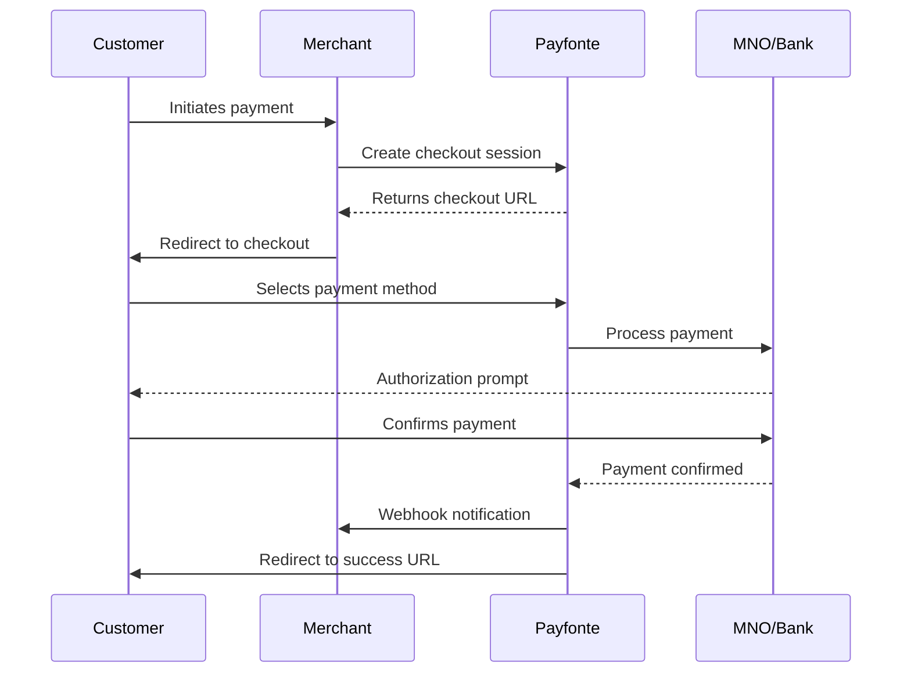

Payfonte provides multiple methods to collect payments from your customers across Africa using our **payment orchestration API**. Accept all major **alternative payment methods (APM)** and **local payment methods in Africa** through a single integration.

---

## Integration Methods

<CardGroup cols={2}>
  <Card title="Inline Checkout" icon="window-maximize" href="/guides/collections/inline">
    **Embed on Your Page**

    Display a payment form directly on your website without redirecting customers. Best for seamless checkout experiences.
  </Card>

  <Card title="Standard Checkout" icon="arrow-up-right-from-square" href="/guides/collections/standard">
    **Redirect to Payfonte**

    Redirect customers to a Payfonte-hosted payment page. Simplest integration with full payment method support.
  </Card>

  <Card title="Direct Charge" icon="bolt" href="/guides/collections/direct-charge">
    **Server-to-Server**

    Initiate charges directly via API for recurring payments or when you've already collected payment details.
  </Card>

  <Card title="Payment Links" icon="link">
    **No-Code Option**

    Generate shareable payment URLs from the dashboard. Perfect for invoices, social media, and email campaigns.
  </Card>
</CardGroup>

---

## Quick Comparison

| Method | Integration Effort | Customer Experience | Use Case |
|--------|-------------------|---------------------|----------|
| **Standard** | Low | Redirect to hosted page | Most merchants |
| **Inline** | Medium | Embedded on your site | Seamless UX |
| **Direct Charge** | High | No UI (server-side) | Recurring, saved cards |
| **Payment Links** | None | Click link to pay | Invoices, ad-hoc |

---

## Payment Flow Overview



---

## Supported Alternative Payment Methods (APM)

| Region | Mobile Money API | Bank Transfer | Cards |
|--------|------------------|---------------|-------|
| **Nigeria** | **MTN MoMo API**, Airtel, Opay, PalmPay | ✅ Yes | Via partner |
| **Ghana** | **MTN MoMo API**, AirtelTigo, Telecel | Coming soon | Via partner |
| **Kenya** | **M-Pesa API** | ✅ Yes | Via partner |
| **Tanzania** | **M-Pesa API**, **Airtel Money API**, Halopesa, Tigo | Coming soon | - |
| **West Africa (CFA)** | Orange Money, MTN, **Wave Money integration**, Moov | - | - |

See [Supported Providers](/guides/introductions/supported-providers) for the complete list of **local payment methods in Africa**.

---

## Basic Collection Request

Here's a minimal example to create a checkout session:

```bash
curl --location 'https://sandbox-api.payfonte.com/payments/v1/checkouts' \
  --header 'client-id: YOUR_CLIENT_ID' \
  --header 'client-secret: YOUR_CLIENT_SECRET' \
  --header 'Content-Type: application/json' \
  --data '{
    "reference": "ORDER-001",
    "amount": 5000,
    "currency": "NGN",
    "country": "NG",
    "redirectURL": "https://yoursite.com/payment/complete",
    "webhook": "https://yoursite.com/webhooks/payfonte",
    "user": {
      "email": "customer@example.com",
      "phoneNumber": "08012345678"
    }
  }'
```

### Required Parameters

| Parameter | Type | Description |
|-----------|------|-------------|
| `reference` | string | Your unique order/transaction identifier |
| `amount` | integer | Payment amount in minor units (see [Amount Specification](/guides/introductions/amount-specification)) |
| `currency` | string | ISO currency code (NGN, KES, GHS, XOF, etc.) |
| `country` | string | ISO country code (NG, KE, GH, etc.) |
| `redirectURL` | string | URL to redirect customer after payment |

### Optional Parameters

| Parameter | Type | Description |
|-----------|------|-------------|
| `webhook` | string | URL for payment notifications |
| `user.email` | string | Customer email address |
| `user.phoneNumber` | string | Customer phone number |
| `metadata` | object | Custom data to attach to transaction |

---

## Handling Webhooks

We send webhook notifications for payment status changes. Always implement webhook handling for production:

```javascript
app.post('/webhooks/payfonte', (req, res) => {
  const event = req.body;

  switch (event.event) {
    case 'payment.completed':
      // Payment successful - fulfill order
      fulfillOrder(event.data.reference);
      break;
    case 'payment.failed':
      // Payment failed - notify customer
      notifyCustomer(event.data.reference);
      break;
  }

  res.status(200).send('OK');
});
```

See [Webhooks](/guides/collections/webhook) for complete documentation.

---

## Best Practices

<AccordionGroup>
  <Accordion title="Always Use Unique References" icon="fingerprint">
    Generate unique `reference` values for each transaction. This prevents duplicate charges and simplifies reconciliation.
  </Accordion>

  <Accordion title="Implement Idempotency" icon="repeat">
    Your system should handle webhook retries gracefully. Check if an order is already fulfilled before processing.
  </Accordion>

  <Accordion title="Verify Transaction Status" icon="check-double">
    After receiving a webhook, verify the transaction status via API before fulfilling orders.
  </Accordion>

  <Accordion title="Handle Timeouts Gracefully" icon="clock">
    Some payment methods (like USSD) take time to complete. Show appropriate waiting states to customers.
  </Accordion>
</AccordionGroup>

---

## Next Steps

<CardGroup cols={2}>
  <Card title="Inline Checkout" icon="window-maximize" href="/guides/collections/inline">
    Embed payments on your site
  </Card>
  <Card title="Standard Checkout" icon="arrow-up-right-from-square" href="/guides/collections/standard">
    Redirect-based integration
  </Card>
  <Card title="Webhook Setup" icon="bell" href="/guides/collections/webhook">
    Handle payment notifications
  </Card>
  <Card title="API Reference" icon="code" href="/api-reference/collections/collection-api--direct">
    Full API documentation
  </Card>
</CardGroup>
