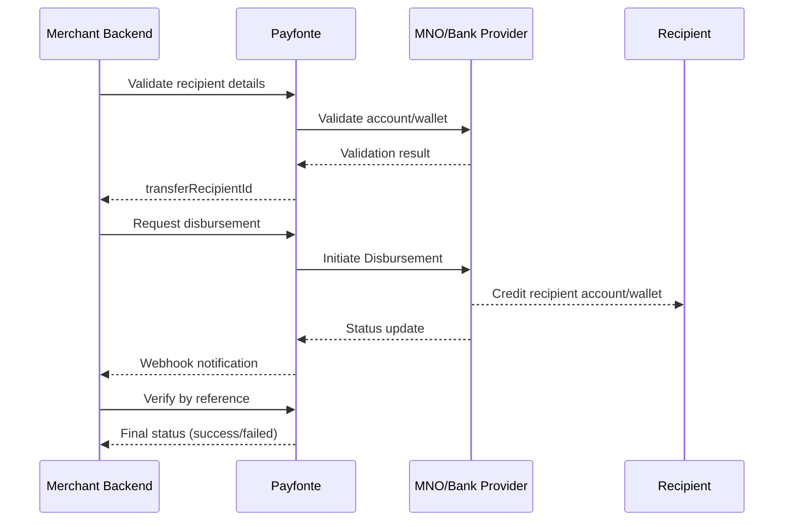

Use Payfonte disbursements to send Disbursements to validated recipients across supported providers and markets.

## Flow Summary

<CardGroup cols={3}>
  <Card title="1. Validate Recipient" icon="user">
    Confirm recipient account details before Disbursement.
  </Card>
  <Card title="2. Request Disbursement" icon="money-bill-transfer">
    Initiate Disbursement with amount, recipient ID, and authorization mode.
  </Card>
  <Card title="3. Verify Final Status" icon="check-double">
    Confirm outcome using verification endpoint and/or webhook.
  </Card>
</CardGroup>

## Disbursement Flow Overview



## Endpoints

| Method | Endpoint | Purpose |
| --- | --- | --- |
| `GET` | `/billing/v1/transfer-recipients/{provider}/properties` | Fetch provider-specific properties (optional) |
| `POST` | `/billing/v1/transfer-recipients/validate` | Validate recipient details |
| `POST` | `/billing/v1/disbursements` | Request disbursement |
| `GET` | `/billing/v1/disbursements/verify/{reference}` | Verify disbursement status |

## Prerequisites

- Valid `client-id` and `client-secret`
- Sufficient Disbursement wallet balance
- Disbursement authorization setup (`pin` or authorization URL flow)
- Valid provider slug from [Supported Providers](/guides/introductions/supported-providers)

## Step 1: Validate Transfer Recipient

### 1.1 Fetch provider properties (optional)

Some providers require extra details (for example bank list/network options) before validation.

```bash
curl --location 'https://sandbox-api.payfonte.com/billing/v1/transfer-recipients/{provider}/properties' \
  --header 'client-id: <client-id>' \
  --header 'client-secret: <client-secret>'
```

### 1.2 Validate recipient

Bank transfer example:

```json
{
  "currency": "NGN",
  "country": "NG",
  "provider": "bank-transfer-nigeria",
  "account": {
    "accountNumber": "0123456789",
    "bankCode": "044"
  }
}
```

Mobile money example:

```json
{
  "currency": "XOF",
  "country": "CI",
  "provider": "wave-ivory-coast",
  "account": {
    "phoneNumber": "2250538102474"
  }
}
```

Sample response:

```json
{
  "data": {
    "id": "recipient-id",
    "currency": "NGN",
    "country": "NG",
    "provider": "bank-transfer-nigeria",
    "accountLabel": "Bank Transfer | Zenith Bank | Dummy User | 0123456789",
    "account": {
      "accountNumber": "0123456789",
      "bankCode": "044"
    }
  }
}
```

Save `data.id` as your `transferRecipientId`.

## Step 2: Request Disbursement

```bash
curl --location 'https://sandbox-api.payfonte.com/billing/v1/disbursements' \
  --header 'client-id: <client-id>' \
  --header 'client-secret: <client-secret>' \
  --header 'Content-Type: application/json' \
  --data '{
    "transferRecipientId": "6659692f019f6a143f7f90db",
    "amount": 100000,
    "reference": "Disbursement-1001",
    "narration": "Vendor settlement",
    "pin": "1234",
    "webhookURL": "https://yourapp.com/webhooks/payfonte"
  }'
```

Sample response:

```json
{
  "data": {
    "reference": "Disbursement-1001",
    "amount": 100000,
    "amountPayable": 100000,
    "provider": "bank-transfer-nigeria",
    "currency": "NGN",
    "country": "NG",
    "status": "processing"
  }
}
```

### Request fields

| Field | Type | Required | Description |
| --- | --- | --- | --- |
| `transferRecipientId` | string | Yes | ID from recipient validation step |
| `amount` | integer | Yes | Amount in minor units (no decimals) |
| `reference` | string | Recommended | Unique Disbursement reference |
| `narration` | string | No | Disbursement description |
| `pin` | string | Conditional | Required when PIN authorization mode is enabled |
| `webhookURL` | string | No | Override webhook URL for this Disbursement |

### Status values

Disbursement status values from API responses:

- `processing`
- `success`
- `failed`

## Step 3: Verify Disbursement

```bash
curl --location 'https://sandbox-api.payfonte.com/billing/v1/disbursements/verify/Disbursement-1001' \
  --header 'client-id: <client-id>' \
  --header 'client-secret: <client-secret>'
```

Sample response:

```json
{
  "data": {
    "status": "success",
    "reference": "Disbursement-1001",
    "externalReference": "Disbursement-1001",
    "amount": 100000,
    "currency": "NGN"
  }
}
```

## Amount Rule (Important)

<Warning>
  Payfonte does not support decimal API amounts. Send integer minor-unit values only.
</Warning>

- `1000.00 NGN` -> `100000`
- `250.75 NGN` -> `25075`

See [Amount Specification](/guides/introductions/amount-specification).

## Best Practices

<AccordionGroup>
  <Accordion title="Always validate recipient first" icon="user" defaultOpen>
    Validation reduces failed Disbursements caused by invalid account details.
  </Accordion>
  <Accordion title="Store recipient IDs for reuse" icon="database">
    Reuse validated recipients to avoid repeated validation requests.
  </Accordion>
  <Accordion title="Use unique references" icon="fingerprint">
    Unique references prevent duplicate Disbursement issues and simplify reconciliation.
  </Accordion>
  <Accordion title="Use webhook + verification" icon="bell">
    Process webhook events and verify final status for critical business actions.
  </Accordion>
  <Accordion title="Protect authorization controls" icon="lock">
    Keep disbursement PIN and authorization URLs strictly server-side.
  </Accordion>
</AccordionGroup>

## Related Docs

<CardGroup cols={3}>
  <Card title="Authorization Mode" icon="key" href="/guides/disbursements/authorization-mode">
    Configure PIN or authorization URL mode.
  </Card>
  <Card title="Disbursement Examples" icon="code" href="/guides/disbursements/examples">
    Request and response payload examples.
  </Card>
  <Card title="Disbursement Webhooks" icon="bell" href="/guides/disbursements/webhook">
    Handle Disbursement status updates asynchronously.
  </Card>
</CardGroup>
